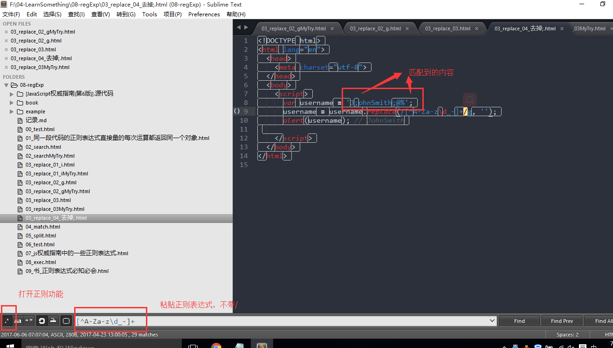
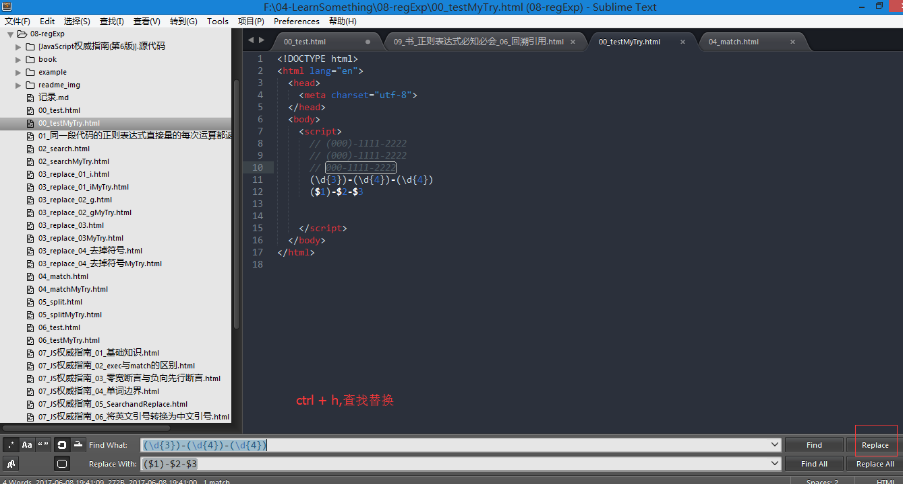

# 说明
## 03_replace_04_去掉;.html
sublime编辑器中`ctrl + F`打开搜索功能，按照下图操作，能直观的看到正则表达式匹配到的内容

## 其他
- 福昕阅读器，做标记挺方便的，高亮、文本框
  例如：https://regexper.com的文档
- chrome， ctrl + f 将网页保存为pdf格式
- sublime编辑器内ctrl+f 打开搜索，alt+r切换正则匹配，输入正则表达式可以搜索，比如`\d`搜索数字
#### 工具
- chrome-extension://pkgccpejnmalmdinmhkkfafefagiiiad/template/fehelper_regexp.html
- https://regexper.com/?#https%3F%3A%5C%2F%5C%2F%5B-%5Cw.%5D%2B(%3A%5Cd%2B)%3F(%5C%2F(%5B%5Cw%2F_.%5D*)%3F)%3F%0A
- 查单词，下一个最新版本的有道词典，设置快捷键ctrl+alt+n 打开mini窗口，方便查词。右击有道词典图标，打开屏幕取词，和划词翻译，可以翻译一些英文句子
  比如看看这个网页的翻译，https://regexper.com/documentation.html，
  可以双击某一个单词查看翻译，也可以选中一条句子，查看意思。